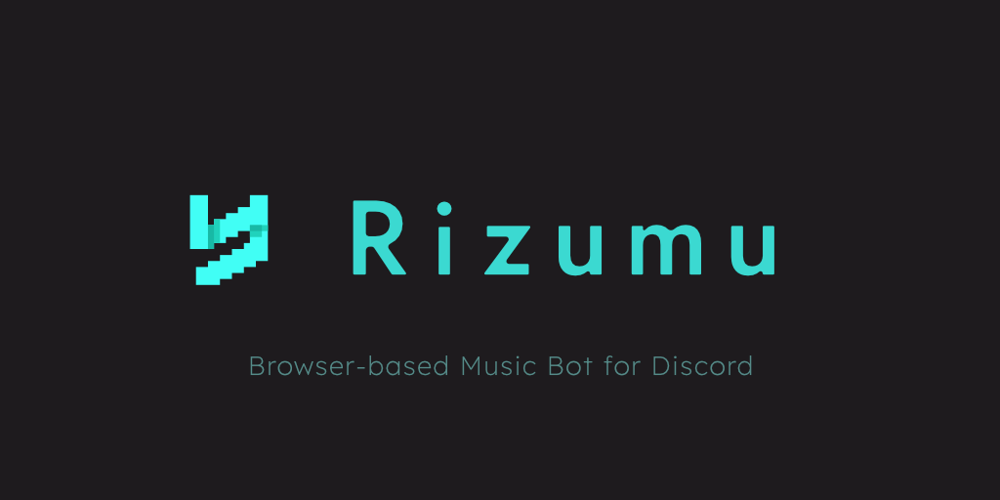

# Rizumu

[](https://github.com/ruccho/rizumu-bot/releases)

Browser-based music bot for Discord.

- **Browser-based**: Rizumu is built on top of [Electron](https://github.com/electron/electron) and opens actual web page which plays audio, enabling it to redirect output to Discord. It does NOT use any download-based solutions.
- Playlists and Queues
- Shuffle and Repeat

### Supported services
- [YouTube](https://www.youtube.com/)
- *Contributions are welcome for other services :)*

## Setup

We do not provide officially-hosted Rizumu so you need to self-host it.

1. Copy `TEMPLATE_config.json` and `TEMPLATE_state.json` to `config.json` and `state.json` in `./state/` folder
2. Fill values in `config.json` and `state.json`
3. Build the image

```sh
docker build -t rizumu .
```

4. Run the container

```sh
docker run -d --name rizumu --restart unless-stopped rizumu
```

## Usage

Use through slash commands (default prefix is `/r` and can be changed by `rizumu_command_prefix` in `config.json`)

```sh
# Let Rizumu join to the voice channel and play a song
/r play https://www.youtube.com/watch?v=jNQXAC9IVRw

# Queue songs from a playlist
/r play https://www.youtube.com/playlist?list=RDCLAK5uy_m1h6RaRmM8e_3k7ec4ZVJzfo2pXdLrY_k

# Next
/r next

# Print current song
/r info

# Print current queue
/r queue

# Clear the queue
/r clear

# Loop current song
/r loop

# Shuffle
/r shuffle

# Leave the channel
/r leave
```